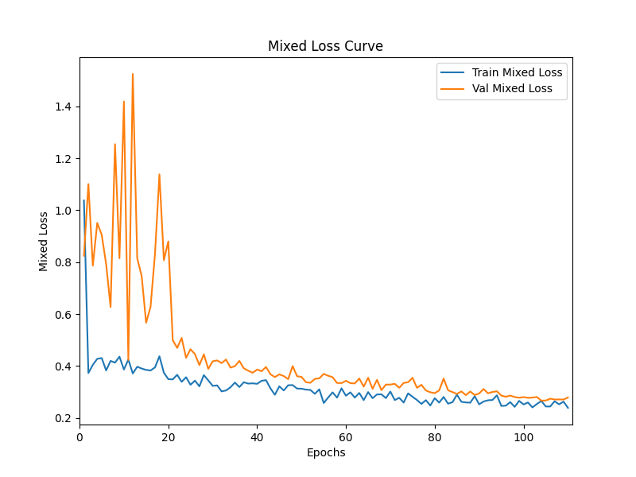
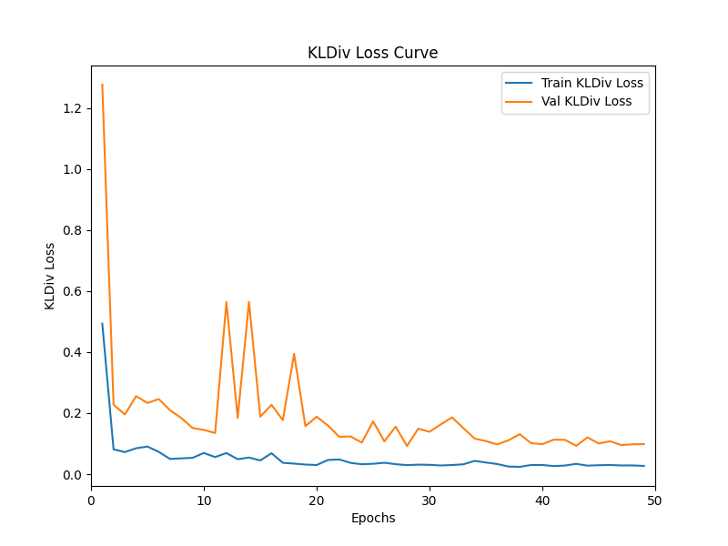

# MET 预测与睡眠状态识别项目

本项目旨在利用可穿戴设备收集的加速度与基础信息，预测用户的**代谢当量（MET）**并识别其**睡眠状态**。采用较为完善的数据处理流程、基于注意力机制的深度模型，使用辅助分类头提升回归任务学习效果，使用软标签与样本加权机制提升分类任务学习效果。

### 数据获取

请从以下链接下载所需数据：
- [All Dataset-Tipdm](https://www.kaggle.com/datasets/parlie/all-dataset-tipdm)

下载后将数据对应放置在 `./附件1` `./附件2` `./B题-测试数据`目录下

---

## 一、项目简介

- **任务类型**：
  - 回归预测：MET（代谢当量）
  - 分类预测：三分类睡眠状态（清醒 / NREM / REM）
- **主要方法**：
  - 模型简要结构：LSTM + Multi-Head Attention + MLP
  - 引入辅助分类头后使用混合损失（回归）
  - 数据驱动与规则融合的软标签（分类）
  - 样本加权 KL 散度分类损失
  - 分层抽样与分布感知训练流程
- **数据来源**：
  - 2025年 泰迪杯数据挖掘挑战赛B题数据

---

## 二、数据处理流程与特征构造

- **平滑与降采样**：
  - 使用 **Median + EMA** 组合滤波，保留趋势同时去噪
  - 对采样率较高的传感器数据进行降采样，减轻模型负担

- **异常值处理**：
  - 使用 Welford 算法在线统计均值、标准差、偏度、峰度等统计量
  - 检测并标注异常值，部分有意义异常值予以保留

- **特征工程**：
  - 构造加速度衍生特征：`acc_L2`, `acc_xy_L2`, `acc_z_abs`, `acc_L2_MET(仅分类用)`
  - 其中 `acc_L2` 采用 Box-Cox 变换提高线性可分性
  - 所有连续变量使用 **Robust Z-Score** 标准化并缩放至 LSTM 有效梯度范围
  - 离散时间特征构造：`is_midnight`, `is_weekend`

- **分类特征编码**：
  - 性别与年龄段使用 one-hot 编码

- **数据集分割**：
  - 基于性别+年龄组合的 **分层抽样**
  - 训练集：60%，验证集：20%，测试集：20%

---

## 三、分类任务中睡眠软标签与样本加权设计

- **标签分为三类**：
  - `state_NO_SLEEP`（清醒）：MET ≥ 1
  - `state_NREM`（非快速眼动睡眠）
  - `state_REM`（快速眼动睡眠）

- **REM状态置信度构造**：
  - 时间因素：随着睡眠时长增长，REM概率逐渐上升
  - 加速度因素：加速度L2范数越低越可能为REM状态
  - 融合置信度：`REM_conf = 0.4 * time + 0.6 * acc_L2(选取0~25%分位数范围)`

- **标签格式（Soft Label）**：
  - 清醒：[1, 0, 0]
  - 睡眠：[0, 1 - REM_conf, REM_conf]

- **KL样本加权机制**：
  - 有效样本数由类别概率与信息熵调整置信度计算得出
  - 类别权重取有效样本倒数，并归一化后乘以3
  - 权重用于 KL 散度损失中的样本加权（类别权重转为样本权重，效果等价）

---

## 四、模型结构

```
输入特征 → 单层 LSTM →
LayerNorm → Multi-Head Self-Attention →
残差连接 → LayerNorm → MLP → 多任务输出
```

- LSTM 用于学习序列短期依赖
- Self-Attention 补充长期依赖
- 使用 **Pre-LayerNorm** 结构以保持梯度稳定
- 回归输出：
  - **主回归头**（MET）
  - **辅助分类头**（是否清醒）（在预测时不使用辅助分类头部分，但初始化模型时需要加载结构，以对应模型参数）
- 分类输出：
  - **睡眠状态分类头**（三分类）

### 回归模型参数（MET预测）

| 参数名 | 数值        |
|--------|-----------|
| `input_size` | 24        |
| `output_size` | 1         |
| `hidden_size` | 64        |
| `lstm_layers` | 1         |
| `seq_len` | 180       |
| `lstm_dropout` | 0         |
| `attn_dropout` | 0.1       |
| `mlp_hidden_layers` | 2         |
| `mlp_hidden_neurons` | [64, 32]  |
| `mlp_activation_fn` | nn.GELU() |
| `mlp_dropout_way` | True      |
| `mlp_dropout` | 0.1       |
| `classifier_hidden_size` | 32        |
| `classifier_output_size` | 2         |

### 分类模型参数（睡眠状态预测）

| 参数名 | 数值        |
|--------|-----------|
| `input_size` | 28        |
| `output_size` | 3         |
| `hidden_size` | 64        |
| `lstm_layers` | 1         |
| `seq_len` | 180       |
| `lstm_dropout` | 0         |
| `attn_dropout` | 0.1       |
| `mlp_hidden_layers` | 2         |
| `mlp_hidden_neurons` | [64, 32]  |
| `mlp_activation_fn` | nn.GELU() |
| `mlp_dropout_way` | True      |
| `mlp_dropout` | 0.2       |

---

## 五、损失函数

- **MET预测**：
  - 回归：`MAE`
  - 辅助分类：`CrossEntropy`
  - 组合损失：`0.7 * MAE + 0.3 * CE`

- **睡眠分类**：
  - 使用样本加权的 `WeightedKLDiv`，处理标签模糊性与不平衡（将每个软标签与类别权重相乘，得到每个样本的权重，将其与每个样本得到的KL散度相乘，得到样本加权的KL散度）

---

## 六、模型训练策略

- **优化器**：AdamW
- **学习率调度器**：Warmup + ReduceLROnPlateau
- **早停机制**：基于验证集 loss 自动停止训练
- **训练方式**：
  - 每轮从训练集 CSV 文件中 **有放回分层抽样40%**
  - 抽中的子集 **在每个 epoch 内训练两次**
  - 所有归一化操作在全量训练集上进行，保持分布稳定

---

## 七、项目结果

对于问题的结果请查看项目中"output_and_result_files"，和链接数据集（Data after running the code (result)）中的"result_2"和"附件2"文件夹

### 回归（MET预测）

| 指标                               | 训练集 | 验证集 | 测试集 |
|----------------------------------|--------|--------|--------|
| Mixed loss(0.7 * MAE + 0.3 * CE) | **0.2657** | **0.2669** | **0.3571** |

### 分类（睡眠状态识别）

| 指标 | 训练集 | 验证集 | 测试集        |
|------|--------|--------|------------|
| KL Loss | **0.0269** | **0.0924** | **0.1382** |

**回归 loss 曲线：**  


**分类 loss 曲线：**  


---

## 八、运行说明

本项目的数据处理与建模采用模块化方式组织，可根据任务需要注释或取消注释相应模块，实现灵活调用。

请在"code"文件夹中找到可运行.py文件进行运行，以下仅提供代码运行顺序

---

### 1. 数据预处理（训练 / 验证 / 测试）

依次运行以下脚本完成清洗、特征工程与归一化：

```bash
# 数据清洗与基础处理
python data_smoothing.py                      # Median + EMA 平滑去噪
python down_sampling.py                       # 降采样（减轻计算量）
python data_preliminary_processing.py         # 数据初步预处理（重复/缺失/分布）
python data_outlier_detection.py              # 异常值检测（检测x,y,z,MET异常值）
python data_outlier_handling.py               # 异常值处理（标记x,y,z,MET异常值）

# 特征构造与异常处理
python data_feature_construction.py           # 特征构造（构造acc_L2,acc_xy_L2,acc_z_abs特征，
                                                      # 并收集这些特征的总数据集分布数据）
python data_outlier_handling_2.py             # 构造特征的异常值处理（标记构造特征的异常值）

# 数据集划分与归一化
python dataset_segmentation.py                # 分层划分训练/验证/测试
python data_dist_estimation.py                # 获取分割后各集分布
python data_normalization_and_encoding.py     # 特征归一化和特征编码（归一化x,y,z,MET,acc_L2,acc_xy_L2,acc_z_abs
                                                                  # ；one-hot编码性别和年龄；Box-Cox转换acc_L2,并收集其训练集分布数据；
                                                                  # 构造离散时间段is_midnight,is_weekend）
python boxcox_accL2_normalization.py          # 单独归一化 boxcox_acc_L2

# 特殊标签处理、归一化与样本加权
python data_annotation.py                     # 数据软标签标注，构造accL2_MET特征
python ques_3_data_dist_get_weight.py         # 获取accL2_MET特征的训练集分布数据；获取类别权重
python ques_3_data_log_transform.py           # 标注accL2_MET特征的异常值；对数变换accL2_MET；获取log_accL2_MET特征的训练集分布数据
python ques_3_log_data_normalization.py       # 单独归一化log_accL2_MET特征

# 可选：最终分布检查
python final_distribution_check.py            # 收集用于训练、验证和测试数据中归一化后的数据分布
```

### 2. 回归任务（MET 预测）

```bash
# 模型训练与验证
python model_train_and_val.py                 # 回归模型训练

# 测试集推理
python model_test.py                          # 回归模型评估
```

### 3. 分类任务（睡眠状态识别）

```bash
# 模型训练与验证
python ques_3_model_train_and_val.py          # 分类模型训练

# 测试集推理
python ques_3_model_test.py                   # 分类模型评估
```

### 4. 多任务结果输出

```bash
# 问题1：统计运动强度时间
python question1_result.py                    # 统计运动强度时间（问题1）

# 问题2：推理 + 统计 MET 相关指标
python question2_result_1.py                  # 使用数据预测MET（问题2）（回归模型推理接口）
python question2_result_2.py                  # 统计运动强度时间（问题2）

# 问题3：推理 + 统计睡眠状态
python question3_result.py                    # 使用数据进行睡眠状态识别，并统计睡眠状态时间（问题3）（分类模型推理接口）

# 问题4：久坐状态预警
python question4_result.py                    # 久坐状态预警（问题4）
```

### 5. 预测数据推理流程（“B题-测试数据”文件夹）

```bash
python data_smoothing.py
python down_sampling.py                       # 如果预测数据为1秒采样，可跳过
python data_outlier_handling.py               # 异常值处理（标记x,y,z异常值，预测数据无MET）
python data_feature_construction.py           # 特征构造（构造acc_L2,acc_xy_L2,acc_z_abs特征；对于预测数据无需收集分布数据）
python data_outlier_handling_2.py

# 然后可运行：
python question2_result_1.py                  # MET 预测
python question3_result.py                    # 睡眠状态识别
```

---

## 九、输入输出格式说明

### 回归任务：MET预测

- 输入特征：

| 特征名称 | 描述 |
|----------|------|
| `hour_sin`, `hour_cos` | 小时的正余弦编码，用于表示时间周期性 |
| `minute_sin`, `minute_cos` | 分钟的正余弦编码 |
| `norm_x`, `norm_y`, `norm_z` | 三轴加速度的标准化值 |
| `sex_F`, `sex_M` | 性别的 one-hot 编码 |
| `age_18-29`, `age_30-37`, `age_38-52`, `age_53+` | 年龄段的 one-hot 编码 |
| `norm_boxcox_acc_L2` | 对加速度模长进行 Box-Cox 变换并归一化 |
| `norm_acc_xy_L2` | 水平面加速度模长的归一化值 |
| `norm_acc_z_abs` | 垂直加速度绝对值的归一化值 |
| `is_outlier_x`, `is_outlier_y`, `is_outlier_z` | x/y/z 三轴加速度是否为异常值（0 或 1） |
| `is_outlier_acc_L2`, `is_outlier_acc_xy_L2`, `is_outlier_acc_z_abs` | 加速度衍生特征是否为异常值 |
| `is_midnight` | 是否为午夜（0 或 1） |
| `is_weekend` | 是否为周末（0 或 1） |

- 输出标签：

| 标签名称 | 描述                           |
|----------|------------------------------|
| `norm_MET_target` | 归一化后的 MET 值（未放缩），未进行反归一化，用于回归预测 |

---

### 分类任务：睡眠状态识别

- 输入特征：

| 特征名称 | 描述                         |
|----------|----------------------------|
| 同 MET 任务所有输入特征 | 包括时间、加速度、性别、年龄、派生特征、异常值指示等 |
| `is_outlier_MET` | 当前时间步 MET 是否为异常值（0 或 1）    |
| `norm_MET` | 归一化后的 MET 值（放缩）              |
| `is_outlier_accL2_MET` | accL2_MET 特征是否为异常值         |
| `norm_accL2_MET` | accL2_MET 特征经对数变换后的归一化值    |

- 输出标签：

| 标签名称                   | 描述                                                                    |
|------------------------|-----------------------------------------------------------------------|
| `sleep_state_encoding` | 睡眠状态编码：<br>`0` = NO_SLEEP（清醒）<br>`1` = NREM（非快速眼动）<br>`2` = REM（快速眼动） |

---

## 十、环境依赖

| 库 / 工具         | 版本            |
|------------------|-----------------|
| Python           | 3.11            |
| pandas           | 2.0.3           |
| numpy            | 1.25.0          |
| scipy            | 1.10.1          |
| scikit-learn     | 1.5.2           |
| tdigest          | 0.5.2.2         |
| matplotlib       | 3.7.2           |
| PyTorch          | 2.6.0+cu124     |

---

## 十一、参考文献

[1] 易明雨. 睡眠监测系统的算法研究与低功耗设计[D]. 湖南: 湘潭大学, 2018.

[2] Dement W, Kleitman N. Cyclic variations in EEG during sleep and their relation to eye movements, body motility, and dreaming[J]. Electroencephalogr Clin Neurophysiol (Suppl), 1957, 9(4): 673–690.

[3] 陈志强. 基于深度学习的儿童睡眠状态监测研究[D]. 重庆: 西南大学, 2024. https://doi.org/10.27684/d.cnki.gxndx.2024.003241.

[4] 牛孟然. 基于重力加速度的睡眠监测系统研究[D]. 河北: 河北科技大学, 2017.

[5] delightroom. 睡眠的科学：了解REM睡眠和NREM睡眠[EB/OL]. https://alar.my/cn/blog/what-is-rem-sleep, 2025-03-11 [2025-03-25].

[6] 孙成开. 基于加速度传感器的人体运动监测研究[D]. 江苏: 苏州大学, 2019. https://doi.org/10.27351/d.cnki.gszhu.2019.003289.

[7] Xiong, Ruibin, Yang, Yunchang, He, Di, Zheng, Kai, Zheng, Shuxin, Xing, Chen, Zhang, Huishuai, Lan, Yanyan, Wang, Liwei, Liu, Tie-Yan. On Layer Normalization in the Transformer Architecture[EB/OL]. arXiv:2002.04745, 2020-06-29. https://arxiv.org/abs/2002.04745.

---
